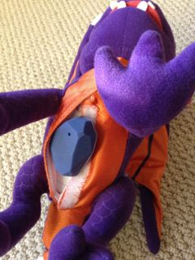
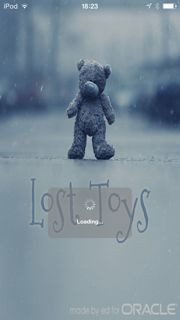
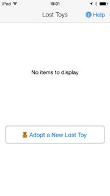
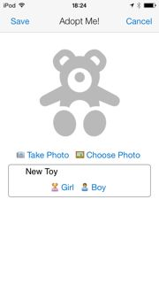
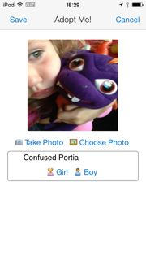
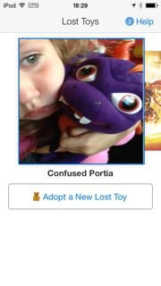
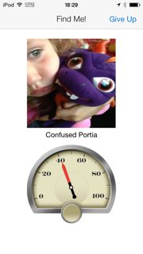
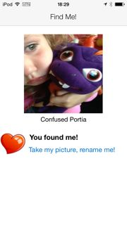

Lost Toys
=========

A mobile app to help you adopt and find Lost Toys. 

An experiment with Oracle MAF and Estimote beacons.

Technologies Used
-----------------

* Oracle JDeveloper 12.1.3.0.0
* Oracle Mobile Application Framework 2.0.0.0.41
* Oracle Application Express 4.2.5.00.08

Framework Features
------------------

* Utilises the [Cordova iOS plugin](https://github.com/apps-ux-ibeacons-hackathon/beacons-cordova-2.x-plugin-for-ios) to interface with Estimote Beacons.
* Customizations were made to the plugin to allow it to vibrate and play sound when toys are detected.
* Uses the Preferences feature of MAF to allow users to specify the UUID for the set of Beacons to use, specify the alert sound to use, specify the "hug proximity", and turn on a debugging mode to display additional information. 
* Uses the MAF local SQLite database for storage of the aopted toys and their pictures, as Base64 strings.
* Interfaces to the device camera and gallery for pictures.
* Random names are generated by calling a RESTful web-service running on Oracle APEX.

How It Works
------------
1. Take a toy, Skylanders work well, and put a beacon in it.  
    

2. Start up the app.  
     ...   

3. You haven't yet adopted any Lost Toys, click the link.  
    

4. Hug the toy you want to adopt.  
    

5. Now you can take his picture, or choose an existing one, and change his name.  
    

6. You can generate a random Girl or Boy name by clicking the links, or enter your own.  
    

7. Now your adopted toy appears in the gallery. You can adopt as many toys as you like. If you lose the toy (like my kids do all the time) you can find it by tapping it in the gallery.  
    

8. In the Finder, the dial shows how close you are to the Lost Toy. You can also use this feature to play Hide'n'Seek with the toy!    
    

9. Once you find a Lost Toy, and hug it, you're rewarded with love! And you can take a new picture, or rename him.  
    

Conclusion
----------

A very simple app, totalling about 24 hours of development over two weeks worth of evenings, that demonstrates the use of a number of MAF features. Used to investigate the workings of Estimote beacons, and the latest release of JDeveloper and MAF.  

I think it could be developed into a cool range of toys for Christmas! Or maybe that's just 'cos my kids are always losing stuff.

